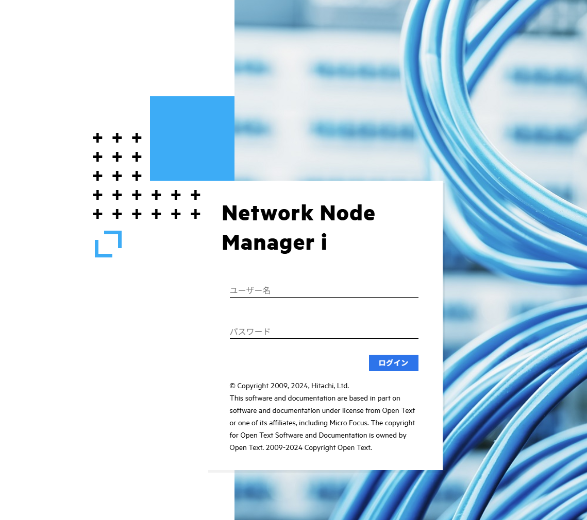

ネットワーク監視製品のJP1/NNMi(体験版)のインストール方法です。

## 事前準備

1. JP1のインストールメディアを入手

JP1の公式サイトから体験版を入手できるので、
必要な情報を入力ししてインストールメディアを入手。

今回はLinux版なので、file `JP1NNMi_1310L.zip`を使用する。

展開するとリリースノートが含まれる"JP1NNMi_1310L_R"があるので、
前提OSやパッケージなどを確認すること。

2. ハードウェア要件（目安）

- メモリ: 8GB 以上
- ディスク: 13GB 以上（/opt/OV と /var/opt/OV に分かれる）
- CPU: 4コア以上（最小構成）

## 構築環境

- OS: OralceLinux9 (on Proxmox)
- CPU: 4Cores
- RAM: 8GB
- DISK: 64GB

## インストール手順

### カーネルパラメータ調整

/etc/sysctl.conf に以下を追加

```sh
# NNM settings for embedded database
kernel.shmmax = 68719476736
kernel.shmall = 68719476736

# NNM settings for UDP receive and send buffer sizes
net.core.rmem_max = 8388608
net.core.wmem_max = 2097152
```

### Yum(DNF) でパッケージをインストール

```sh
sudo dnf install -y \
  libaio.x86_64 \
  libXtst.x86_64 \
  libXi.x86_64 \
  net-tools.x86_64 \
  unzip.x86_64 \
  fontconfig.x86_64 \
  liberation-sans-fonts.noarch \
  libnsl.x86_64 \
  traceroute.x86_64   # 特定機能利用時に必要
```


### Hitachi PP Installer の起動

以下で起動する。
ISOを展開したディレクトリを指定するか、ISOファイルをマウントして指定してもよい。

```sh
cd JP1NNMi_1310L_P/X64LIN
./SETUP ./../
```

```sh
  Hitachi PP Installer  05-34


    L) List Installed Software.
    I) Install Software.
    D) Delete  Software.
    Q) Quit.


    Select Procedure ===>


    +----------------------------------------------------------------------+
      CAUTION!
      YOU SHALL INSTALL AND USE THE SOFTWARE PRODUCT LISTED IN THE
      "List Installed Software." UNDER THE TERMS AND CONDITION OF
      THE SOFTWARE LICENSE AGREEMENT ATTACHED TO SUCH SOFTWARE PRODUCT.
    +----------------------------------------------------------------------+
```

以下の対話は必要に応じて設定変更する。  
`お待ちください`で5分くらい待機した。  


```sh
** Network Node Manager i Installer **
* Starting NNMi  installation.
*Enter default port for HTTP server
* [20480]

*Enter default port for HTTPS server
* [20481]

* http port : 20480
* https port : 20481
* Do you start installation with above settings you entered ? (yes/no)
* If you need to change the settings, please enter no.
yes
* Starting NNMi Precheck ...
* NNMi Precheck result: OK
Installing NNMi ...
Please wait while Micro Focus Installer is initializing ...

お待ちください ... 
```

`Installation completed.`と出たら完了です。

### インストール後の確認

`nettrap.service`と`netmgt.service`の起動を確認する。

```sh
[root@localhost ~]# systemctl status nettrap.service 
● nettrap.service - Network Node Manager i Trap Receiver
     Loaded: loaded (/usr/lib/systemd/system/nettrap.service; enabled; preset: disabled)
     Active: active (exited) since Mon 2025-09-15 01:25:40 JST; 4min 42s ago
   Main PID: 1154 (code=exited, status=0/SUCCESS)
      Tasks: 475 (limit: 99032)
     Memory: 3.8G
        CPU: 4min 12.780s
     CGroup: /system.slice/nettrap.service
```

```sh
[root@localhost ~]# systemctl status netmgt.service 
● netmgt.service - Network Node Manager i
     Loaded: loaded (/usr/lib/systemd/system/netmgt.service; enabled; preset: disabled)
     Active: active (exited) since Mon 2025-09-15 01:27:17 JST; 3min 38s ago
   Main PID: 1656 (code=exited, status=0/SUCCESS)
```

ついでに、今回はファイアウォールが邪魔しないように`firewalld`も無効化しておく。

```sh
systemctl disable firewalld.service
```

### 管理コンソールへのアクセス

以下でブラウザアクセスします。

`https://<NNMiホスト名>:20481/nnm/`

以下の画面が出れば成功。
LANケーブルが写っているデザインでかっこいいですね。

初期IDは`system`, パスワードはインストール時に設定したもの。



インストール直後のOracleLinux9の消費メモリ量は約6GB程度。